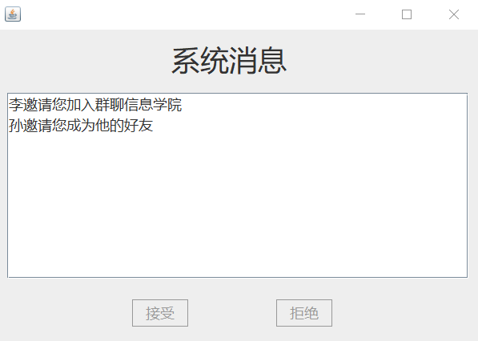

# 即时聊天系统Demo报告
> PB16111485 张劲暾&emsp;PB16080210 戴路&emsp;PB16110428 王浩宇&emsp;

---

## 目录

[TOC]

---

## 实验环境

+ 操作系统：`Windows 10`
+ 语言： `Java 8`
+ `IDE`： `NetBeans 8.2`

## 实现功能
### 注册

+ 用户输入昵称、性别和密码，发送给服务器
+ 服务器接收这些信息，自动生成账号，并进行存储
+ 生成的账号会反馈给用户，用户之后可以使用账号和密码登录

### 登录
+ 用户使用账号和密码登录
+ 密码在服务器端加盐哈希保存
+ 通过对密码进行哈希校验判断是否正确

### 私聊
+ 用户在聊天对象的聊天栏中输出准备发送的聊天信息，点击发送按钮后信息将会被发送给服务器
+ 对方在线时服务器直接转发
+ 对方不在线时服务器进行缓存，待其上线后再发送
+ 当收到服务器转发的聊天信息时，客户端根据发送方将其加入相应的消息队列，并在屏幕上显示

### 群聊
+ 用户在群聊的聊天栏中输出准备发送的聊天信息，点击发送按钮后信息将会被发送给服务器
+ 群成员在线时服务器直接转发
+ 群成员不在线时服务器进行缓存，待其上线后再发送
+ 当收到服务器转发的聊天信息时，客户端根据归属的群将其加入相应的消息队列，并在屏幕上显示

### 通讯录
+ 添加好友
  + 用户输入准备添加的好友账号，客户端自动生成对应的系统消息发送给服务器
  + 对方在线时服务器直接转发
  + 对方不在线时服务器进行缓存，待其上线后再发送
  + 对方接收到好友邀请时，可以选择接受或拒绝，客户端自动生成对应的系统消息发送给服务器
  + 服务器根据接收到的系统消息操作双方的通讯录，并转发给邀请方
+ 查看好友信息
  + 用户可以在客户端查看好友的基本信息
+ 删除好友
  + 用户点击按钮删除好友，客户端自动生成对应的系统消息发送给服务器
  + 服务器从双方的通讯录中删除对方，并转发该系统消息
  + 被删除好友的一方可以通过系统消息知悉

### 群管理
+ 新建群聊
  + 用户输入新建群聊的名称，即可作为群主建立新群，群名称将被发送给服务器
  + 服务器创建一个新群聊，将其加入群主的通讯录，并向群主反馈群号
+ 邀请新成员
  + 群主输入准备邀请的成员账号，客户端自动生成对应的系统消息发送给服务器
  + 对方在线时服务器直接转发
  + 对方不在线时服务器进行缓存，待其上线后再发送
  + 对方接收到加群邀请时，可以选择接受或拒绝，客户端自动生成对应的系统消息发送给服务器
  + 服务器根据接收到的系统消息操作通讯录和群成员列表，并转发给邀请方
+ 退出群聊
  + 群成员点击按钮退群，客户端自动生成对应的系统消息发送给服务器
  + 服务器在通讯录和成员列表中进行删除，并转发该系统消息
  + 群主可以通过系统消息知悉
+ 查看群信息
  + 用户可以在客户端查看自己加入的群聊的基本信息

### 系统消息
&emsp;&emsp;用户可以统一查看所有的系统消息，对于某些邀请类消息，可以进行接受操作或拒绝操作。
### 图形用户界面（GUI）
&emsp;&emsp;采用标准的`Java Swing`库完成用户界面。

## 项目结构


## 多线程管理
### 服务器
&emsp;&emsp;使用线程池管理线程，每接到一个TCP连接请求就新建一个线程。该线程会接收对应的客户端发送的所有报文并进行处理，返回对应的报文。当客户端退出时，该线程也会结束。
### 客户端
&emsp;&emsp;新建一个监听线程接收服务器发送的报文并进行处理；另有GUI线程处理用户在界面上的操作，根据不同的操作发送不同的报文。

## TCP连接
1. 绑定服务器
```java
//服务器端代码
ServerSocket server = new ServerSocket(SERVERPORT);//将服务器绑定在周知端口号
```

2. 客户端发起连接，得到socket
```java
//客户端代码
socket = new Socket("127.0.0.1",SERVERPORT);//客户端向服务器发起连接
```
3. 服务器接受连接，得到socket
```java
//服务器端代码
Socket socket = server.accept();//接受客户端的连接请求
```
4. TCP交互
```java
//两端的代码相同
Scanner sc = new Scanner(socket.getInputStream());//得到输入流
PrintWriter writer = new PrintWriter(socket.getOutputStream());//得到输出流
```
&emsp;&emsp;Java会将TCP连接包装为输入输出流，使用TCP报文等价于使用流。在本项目中，每一份报文使用换行符分割。在读取时，使用Scanner类的readLine()方法；在输出时先使用PrintWriter类的println()方法，之后再使用flush()方法确保信息被发送。
## TCP报文

### 注册
&emsp;&emsp;客户端发送下面的报文，注意使用方括号包裹的是一个字符串变量，空格作为分隔符。
> Register [name] [sex] [password]  

&emsp;&emsp;服务器接收后发送下面的报文(User的toString()方法已经重载)：
> NewUser [user]

### 登录
&emsp;&emsp;客户端发送下面的报文：
> Login [ID] [password]

&emsp;&emsp;服务器接收后，如果用户存在且密码正确，发送下面的报文：
> LoginSucceed [user]

&emsp;&emsp;否则，发送下面的报文：
> LoginFailed

### 消息

&emsp;&emsp;客户端发送下面的报文：
> Message [type] [sender] [receiver] [content]

&emsp;&emsp;服务器接收后，如果接收方在线就进行转发，否则将其缓存，转发时增加发送时间的字段：
> Message [type] [sender] [receiver] [date] [content]


&emsp;&emsp;根据不同的type,服务器进行下面的处理：

+ 私聊
  + type=0
  + sender是发送方的ID
  + receiver是接收方的ID
  + content是聊天信息内容
  + 服务器将其转发
+ 群聊
  + type=1
  + sender是发送方的ID
  + receiver是群ID
  + content是聊天信息内容
  + 服务器将其转发给所有群成员
+ 邀请好友
  + type=2
  + sender是邀请方的ID
  + receiver是被邀请方的ID
  + content无效
  + 服务器将其转发
+ 接受好友邀请
  + type=3
  + sender是被邀请方的ID
  + receiver是邀请方的ID
  + content无效
  + 服务器修改双方的通讯录，并将其转发
+ 拒绝好友邀请
  + type=4
  + sender是被邀请方的ID
  + receiver是邀请方的ID
  + content无效
  + 服务器将其转发 
+ 删除好友
  + type=5
  + sender是主动删除方的ID
  + receiver是被删除好友的ID
  + content无效
  + 服务器修改双方的通讯录，并将其转发
+ 邀请加入群聊
  + type=6
  + sender是邀请方的ID
  + receiver是被邀请方的ID
  + content是群ID
  + 服务器将其转发
+ 接受入群邀请
  + type=7
  + sender是被邀请方的ID
  + receiver是群ID
  + content无效
  + 服务器修改被邀请方的通讯录和群信息，并将其转发给所有群成员
+ 拒绝入群邀请
  + type=8
  + sender是被邀请方的ID
  + receiver是邀请方的ID
  + content是群ID
  + 服务器将其转发
+ 退群
  + type=9
  + sender是准备退群者的ID
  + receiver是群ID
  + content无效
  + 服务器修改通讯录和群信息，并将其转发给群主
### 建群
&emsp;&emsp;客户端发送以下报文：
> NewGroup [name]

&emsp;&emsp;服务器建立群聊，将它加入群主的通讯录，返回下面的报文：
> Group [group]  


### 获取数据
&emsp;&emsp;客户端发送以下报文：
> Get {User|Group|AddressBook} [ID]

&emsp;&emsp;服务器根据ID和类型返回下列报文：  
> User [user]  
> Group [group]  
> AddressBook [addressbook]

&emsp;&emsp;三者的toString()方法均已重载。

### 获取消息
&emsp;&emsp;客户端发送以下报文：
> Fetch [ID]

&emsp;&emsp;服务器根据ID返回缓存的所有消息。

### 退出
&emsp;&emsp;客户端发送下面的报文：
> Exit

## 数据管理

### 用户数据
&emsp;&emsp;下面的两个类用于管理用户数据。User类储存了用户数据，UserManager类管理所有的用户数据。
```java
public class UserManager {
    private static final int MAXUSERS=100;
    private static final int STARTNUM=10000;
    private static final User[] USERS=new User[MAXUSERS];
    static User getUser(String ID){
    }
    static void addUser(User user){
    }
    private static int getValidID(){
    }
    static User createUser(String name,String sex,String password){
    }   
}
class User{
    private final String ID;//用户ID，唯一
    private String name;//昵称，不唯一
    private String sex;//性别
    private final String password;//密码
    private static String salt;//盐
    public User(String ID,String password){
    }
    public User(String ID, String name, String sex,String password) {
    } 
    public String getID(){
    }
    public String getName(){
    }
    public void setName(String name){
    }
    public String getSex(){
    }
    public void setSex(String sex){
    }
    @Override
    public String toString(){
    }
    /**
     * 检验密码是否正确
     * @param s 输入的密码
     * @return 密码是否正确
     */
    public boolean checkPassword(String s){
    }   
    /**
     * 对密码加盐后计算MD5
     * @param dataStr 原始数据
     * @return 加盐后的MD5
     */
    private static String encrypt(String dataStr) {
    }   
}
```

### 群聊数据
&emsp;&emsp;下面的两个类用于管理群聊数据。Group类储存了群聊数据，GroupManager类管理所有的群聊数据。
```java
public class GroupManager {
    private static final int MAXGROUP=100;
    private static final int STARTNUM=10000;
    private static final Group[] GROUPS=new Group[MAXGROUP];
    static Group getGroup(String ID){
    }
    static void addGroup(Group group){
    }
    private static int getValidID(){
    }
    static Group createGroup(String name,String master){
    }
}
class Group{
    private final String ID;//群ID，唯一
    private String name;//群名称，不唯一
    private final String master;//群主的ID
    private final Set<String> memberList;//群成员列表
    public Group(String ID,String name,String master){
    }   
    public String getID(){
    }
    public String getName(){
    }
    public void setName(String name){
    }
    public String getMaster(){
    }
    public String[] getMemberList(){
    }
    /*
     * 增加群成员
     * @param user 群成员ID
     */
    public void addMember(String user){
    }  
    /**
     * 删除群成员
     * @param user 群成员ID
     */
    public void deleteMember(String user){
    }    
    @Override
    public String toString(){
    }   
    public static Group toGroup(String s){
    }
}
```

### 通讯录数据
&emsp;&emsp;下面的两个类用于管理通讯录数据。AddressBook类储存了通讯录数据，AddressBookManager类管理所有的通讯录数据。
```java
public class AddressBookManager {
    private static final int MAXUSERS=100;
    private static final int STARTNUM=10000;
    private static final AddressBook[] BOOKS=new AddressBook[MAXUSERS];
    static AddressBook getAddressBook(String ID){
    }
    static void addAddressBook(String ID,AddressBook addressBook){
    } 
}

class AddressBook{
    private Set<String> friendList;//好友列表
    private Set<String> groupList;//群聊列表
    public AddressBook(){
    }
    public String[] getFriendList(){
    }
    public String[] getGroupList(){
    }
    public void addFriend(String user){
    }
    public void deleteFriend(String friend){
    }
    public void addGroup(String group){
    }
    public void deleteGroup(String group){
    }
    @Override
    public String toString(){
    }
}
```

### 消息数据
&emsp;&emsp;下面的两个类用于管理消息数据。Message类储存了消息数据，MessageManager类管理所有的消息数据。

```java
public class MessageManager {
    static Map<String,ArrayList<Message>> cachedMap=new HashMap<>();
    //维护聊天信息缓存
    static Map<String,Socket> onlineMap=new HashMap<>();
    //维护所有在线的用户
    /**
     * 转发聊天信息。如果接收方没有在线，就将其缓存；如果在线，就直接发送。
     * @param type 聊天信息类型。0代表私聊，1代表群聊。
     * @param sender 发送方ID
     * @param receiver 接收方ID（可能是群ID，也可能是用户ID）
     * @param content 聊天信息内容
     */
    public static void forwardMessage(int type, String sender, 
    String receiver,  String content){      
    }
    /**
     * 通过端口发送聊天信息。
     * @param socket 端口
     * @param message 聊天信息
     */
    static void sendMessage(Socket socket,Message message){
    }   
    /**
     * 将用户、端口对加入哈希表，并发送所有缓存的消息
     * @param user 用户
     * @param socket 端口
     */
    public static void insertOnlineUser(String user,Socket socket){
    }    
    /**
     * 从哈希表中删除用户
     * @param user 用户
     */
    public static void deleteSocket(String user){
    }    
    /**
     * 解析消息
     * @param type 类型
     * @param sender 发送方
     * @param receiver 接收方
     * @param content 内容
     */
    public static void analyseMessage(int type,String sender,
    String receiver,String content){
    }   
}
class Message{
    private final String sender;//发送方ID
    private final String receiver;//接收方ID
    private final int type;//0代表私聊信息，1代表群聊信息，大于等于2表示系统消息
    private final String content;//内容
    private final Date date;//发送时间
    public Message(int type, String sender, String receiver,String content){
    }    
    public String getSender() {
    }
    public String getReceiver() {
    }
    public int getType() {
    }
    public String getContent() {
    }
    /**
     * 获取该信息的实际接受者列表。
     * 如果是私聊信息，接受者只有一个；如果是群聊信息，接受者有多个。
     * @return 接收者列表
     */
    public String[] getReceiverList(){
    }    
    @Override
    public String toString(){
    }    
}
```

## 系统演示
### 登录界面
**&emsp;&emsp;点击注册跳转到注册界面；输入账号密码后点击登录，如果密码正确跳转到主界面，否则弹出对话框提示账号或密码错误。**  

### 注册界面
**&emsp;&emsp;填写所有信息后点击注册按钮：如果两次输入的密码不相同，则弹出对话框提示；如果相同，弹出对话框告知系统分配的账户，并自动跳转到主界面（相当于直接登录）。**  

### 主界面-私聊消息
**&emsp;&emsp;在主界面中点击左侧的聊天消息按钮可以查看聊天消息。再点击列表中的用户，在右上文本框中显示对应的聊天信息。在右下的输入框中输入想要发送的内容，再点击发送按钮进行发送。**  

### 主界面-群聊消息
**&emsp;&emsp;在主界面中点击左侧的聊天消息按钮可以查看聊天消息。再点击列表中的群聊，在右上文本框中显示对应的聊天信息。在右下的输入框中输入想要发送的内容，再点击发送按钮进行发送。**   

### 主界面-联系人
**&emsp;&emsp;在主界面中点击左侧的联系人按钮可以查看联系人。加号用于添加好友。点击列表中的好友，在右侧显示对应的信息，点击删除好友按钮可以删除该好友。**     

### 主界面-群聊
**&emsp;&emsp;在主界面中点击左侧的群聊按钮可以查看群聊。加号用于新建群聊。点击列表中的群聊，在右侧显示对应的信息。群主在输入框中输入想要邀请的用户账号，再点击邀请按钮可以发送邀请。**     


**&emsp;&emsp;普通群成员可以点击退出群聊按钮退出群聊。**   

### 系统消息界面
**&emsp;&emsp;在主界面中点击左侧的系统消息按钮会弹出系统消息界面。点击列表中的消息，如果该消息是一个邀请，那么接受和拒绝按钮都是可用的，可以点击以接受或拒绝邀请。**     


